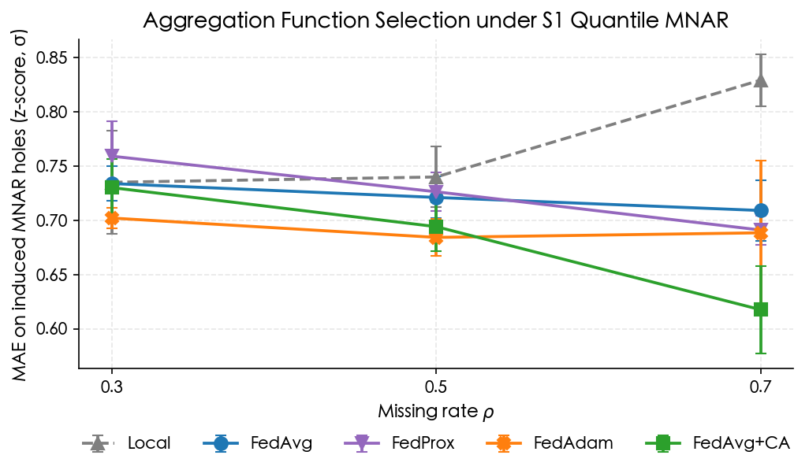
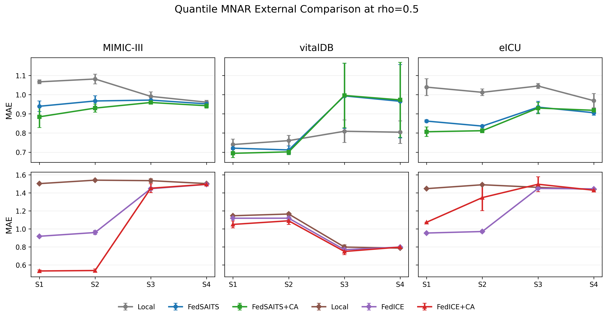
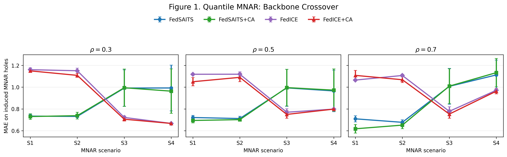
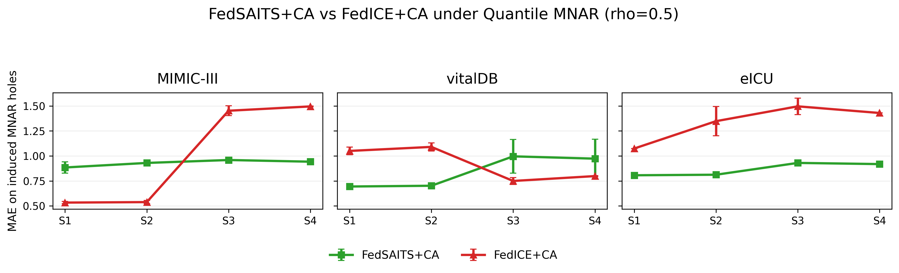
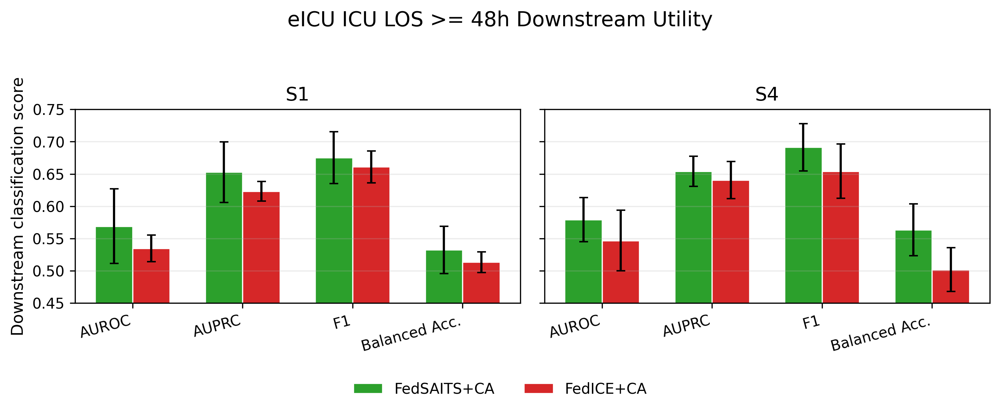

# Federated Clinical Time-Series Imputation under Heterogeneous MNAR

**Personalized federated imputation of clinical vital-sign time series, extending
complementarity-aware aggregation (CAFE) to deep sequence models — evaluated
across three clinical datasets, two imputation backbones, and four heterogeneous
MNAR scenarios.**


> Clinical vital-sign time series are riddled with missing values, and in the real
> world that missingness is usually **Missing-Not-At-Random (MNAR)** — a value is
> absent *because of* the patient's state or the measurement workflow. When such
> records are spread across hospitals that cannot pool raw data, **federated
> learning (FL)** is the natural way to train a joint imputer. Yet most federated
> imputation work assumes simple MCAR/MAR missingness, and the one method that
> targets *heterogeneous MNAR* — **CAFE** (Min et al., 2025) — was built for
> **tabular** data and statistical ICE models. **This project asks whether
> complementarity-aware aggregation transfers to deep clinical time-series
> imputation, and when it actually helps.**

**Capstone project · National Cheng Kung University, CSIE (C-17)** · Author: Joshua Tseng (曾令城) · Advisor: Prof. Kun-Ta Chuang (莊坤達)

> 🏆 **Honorable Mention (佳作) · Top 8** at the [**NCKU CSIE 2026 Capstone Project Exhibition**](https://www.csie.ncku.edu.tw/php/csie_project/year.php?year=2026#2) (project C-17).

---

## Highlights

- Extends CAFE's **complementarity-aware (CA)** federated aggregation from tabular
  MICE to **deep time-series imputation (SAITS)**, and benchmarks it against a
  statistical **ICE** backbone.
- A systematic study over **3 clinical datasets** (VitalDB, MIMIC-III subset,
  eICU-demo) × **2 backbones** (FedSAITS, FedICE) × **4 heterogeneous MNAR
  scenarios** (S1 fully complementary → S4 non-complementary) × **ρ ∈ {0.3, 0.5, 0.7}**.
- **Three findings:** (1) FL beats local training under complementary MNAR
  (~18.4% mean MAE reduction at ρ=0.7); (2) missingness **complementarity is an
  effective aggregation signal** — `+CA` wins in most scenarios; (3) there is **no
  universally best backbone** — SAITS vs ICE trade places by scenario and dataset.
- A **downstream eICU ICU length-of-stay** task confirms that better imputation
  → better clinical prediction (AUROC / AUPRC / F1).
- Diagnostic analysis of CAFE's sharpening hyperparameter shows its default
  `β=4` is too aggressive for SAITS (98%+ of peer weight collapses onto one
  minority client); **β=0.5** is the stable setting used for FedSAITS+CA.

---

## The question, and the setup

CAFE's insight: if hospital A systematically misses *low* glucose values and
hospital B misses *high* ones, their observable distributions are **complementary**
— each holds information the other lacks. CAFE estimates a per-client
missing-mechanism "fingerprint" (logistic regression on the missing mask), scores
pairwise complementarity, and uses it for **personalized** aggregation weights.
It was validated only on tabular data with ICE. Time series adds a deep
self-attention backbone (SAITS) and temporal autocorrelation — so whether the idea
survives is an empirical question.

**Datasets** (preprocessed to `(N, T, D)` tensors; raw data not distributed):

| Dataset | Source | Tensor `(N,T,D)` | MNAR target features | Clients | Truly federated? |
|---|---|---|---|---|---|
| **VitalDB** (main) | Surgical vital signs | (2500, 300, 14) | HR, NIBP_SBP, SpO₂ | 5 | No — random equal split |
| **MIMIC-III** subset | ICU time series | (705, 24, 4) | resp_rate, heart_rate, temperature, sbp | 3 | No — simulated split |
| **eICU-demo** | PhysioNet eICU Demo 2.0.1 | (1298, 288, 6) | HR, RR, SpO₂ | 5 | **Yes — hospital-cluster clients** |

**Backbones:** `FedSAITS` (deep self-attention imputer via PyPOTS; 50 rounds × 5
local epochs) and `FedICE` (linear chained-equation baseline; 20 ICE rounds, Ridge
regression) — the deep vs. statistical counterparts.

**Aggregators:** `Local`, `FedAvg`, `FedProx` (μ=0.01), `FedAdam`, and `+CA`
(complementarity-aware). CA config follows CAFE (α=0.95, γ=0.02); FedSAITS+CA uses
sharpening **β=0.5**, FedICE+CA keeps CAFE's **β=4**.

**MNAR scenarios** (control how complementary the clients' missing supports are):

| | Definition | Complementarity |
|---|---|---|
| **S1** | Client 0 MNAR-Left, others MNAR-Right | **High** |
| **S2** | S1 but missing rates not fully matched | Partial |
| **S3** | All MNAR-Left, different missing rates | Low (one-sided/nested) |
| **S4** | All MNAR-Left, same missing rate | **None** |

Two MNAR simulators (CAFE-style): **quantile** (hard threshold, clear low/high-tail
missing support — used for the main results) and **logit** (smooth probabilistic —
a robustness setting). Imputation is evaluated by MAE/RMSE on artificially induced
MNAR holes only.

---

## Findings

### 1 · Federated learning improves time-series imputation

Under the high-complementarity **S1 quantile** scenario, every federated aggregator
beats isolated local training, and the gap widens with the missing rate — about a
**18.4% mean MAE reduction at ρ=0.7**.



S1 quantile MAE (VitalDB, SAITS backbone, mean ± std over 5 seeds; lower is better):

| Method | ρ = 0.3 | ρ = 0.5 | ρ = 0.7 |
|---|---|---|---|
| Local (no federation) | 0.735 | 0.740 | 0.829 |
| Centralized (reference) | 0.740 | 0.699 | 0.753 |
| FedAvg | 0.734 | 0.721 | 0.709 |
| FedProx | 0.759 | 0.726 | 0.691 |
| **FedSAITS + CA (β=0.5)** | **0.730** | **0.694** | **0.618** |

### 2 · Complementarity is an effective aggregation signal

Extending CA to time series, `FedSAITS+CA` (and `FedICE+CA`) attain the lowest MAE
in most S1–S4 cells across eICU, MIMIC-III, and VitalDB — evidence that
missing-data complementarity is a usable signal for federated aggregation under
heterogeneous MNAR, not just a tabular artifact.



### 3 · No universally best backbone — and imputation quality drives downstream tasks

Which backbone wins is **scenario- and dataset-dependent**. On VitalDB,
`FedSAITS+CA` leads in the complementary regimes (S1/S2) while `FedICE+CA` takes
the low-complementarity regimes (S3/S4) — a clean crossover; on MIMIC-III and eICU,
`FedSAITS+CA` leads in most scenarios. This echoes TSI-Bench's observation that no
single imputer dominates everywhere.




On a **downstream eICU ICU length-of-stay (≥48h) classification** task, the
lower-MAE `FedSAITS+CA` also yields better AUROC / AUPRC / F1 — better federated
imputation translates into better clinical prediction.



### Under the hood — diagnosing when CA helps

- **Sharpening (β).** CAFE ships `β=4`; on SAITS this is too sharp — majority
  clients route 98%+ of their peer weight onto a single minority client, and when
  that client's local model is weak the majority degrades (≈ −20% at S1 ρ=0.3).
  Sweeping below CAFE's grid, **β=0.5** is the stable choice. *(See appendix figure.)*
- **Per-client view.** Mean MAE hides who benefits; a per-client breakdown shows CA
  is a majority→minority "pull" whose value depends on whether the highly-weighted
  peer actually carries complementary information.
- **Held-out validation.** On client-local held-out test cases (fingerprints and
  training use train cases only), FedSAITS+CA still improves ≈ **12.5%** over FedAvg
  at S1 quantile ρ=0.7 — the gain is not an artifact of same-case reconstruction.
- **Quantile vs. logit MNAR.** Under smooth *logit* MNAR the LR fingerprint loses
  discriminative power (LR/MI/RF all near-uniform), so CA reverts to ≈FedAvg — a
  time-series-specific open problem for sequence-aware fingerprints.

Full write-up, tables, and appendix analysis are in the [**research report**](docs/research_report.pdf) (see *Project materials* below).

---

## Project materials

The capstone materials (my own work; advisor-approved for publication and already
hosted on the official department showcase):

- 📄 **[Research report (PDF)](docs/research_report.pdf)** — full paper with methods, results, and appendix
- 🖼️ **[Poster (PDF)](docs/poster.pdf)**
- 🎞️ **[Slides (PDF)](docs/slides.pdf)**
- 🔗 **[Official NCKU CSIE 2026 exhibition page](https://www.csie.ncku.edu.tw/php/csie_project/year.php?year=2026#2)** (poster, slides, and demo video · project C-17)

## Repository structure

```
.
├── src/
│   ├── models/          # SAITS wrapper (FederatedSAITS) + transformer backbone
│   ├── federation/      # ⭐ aggregation.py: FedAvg / FedProx / FedAdam / CA
│   │                    #    saits_server.py, saits_client.py (main FL stack)
│   ├── data/            # dataset loaders, heterogeneous allocator, MNAR masking
│   ├── baselines/       # fedice.py — federated ICE (statistical backbone)
│   ├── agents/          # earlier MARL exploration (see note below)
│   ├── environment/     # RL imputation environment (earlier exploration)
│   └── utils/           # metrics, logging
├── experiments/         # experiment runners (MNAR sweep, centralized, downstream)
│   └── analysis/        # plotting & analysis scripts (reproduce the figures)
├── configs/             # YAML configs
├── scripts/             # shell/pwsh launchers for experiment sweeps
└── docs/                # research report, poster, slides (PDF) + result figures
```

> **Note on `src/agents/` & `src/environment/`:** an earlier phase explored
> multi-agent RL (MAPPO) for imputation before the project pivoted to the
> SAITS/ICE federated study reported here. That code is kept for completeness but
> is not part of the results above.

## Installation

```bash
git clone https://github.com/itisJoshuaTseng/federated-time-series-imputation.git
cd federated-time-series-imputation

conda env create -f environment.yml && conda activate fed-marl   # or: pip install -r requirements.txt
```

## Reproducing experiments

Dataset tensors are **not** shipped (see *Data*). With the VitalDB tensor in place
(path in `configs/vitaldb.yaml`):

```bash
bash scripts/run_mnar_smoke_test.sh                 # quick smoke test
python experiments/run_mnar_experiment.py --help    # main MNAR sweep (S1–S4 × ρ × seeds)
python experiments/run_centralized_baseline.py      # centralized reference
python experiments/run_eicu_downstream_los.py       # downstream ICU-LOS task
python experiments/analysis/plot_all_mnar_results.py # regenerate figures
```

## Data

All three datasets are open but governed by their own data-use terms; **no raw or
preprocessed patient data is included** here — only loaders and preprocessing
scripts (`src/data/`, `experiments/prepare_*_tensor.py`).

- **VitalDB** — open surgical biosignal database, <https://vitaldb.net/>
- **MIMIC-III** — Johnson et al., 2016 (credentialed access via PhysioNet)
- **eICU Collaborative Research Database (Demo 2.0.1)** — Pollard et al., 2018 (PhysioNet)

---

## Related work & attribution

No third-party source code is vendored here; the methods below are re-implemented
from their papers or used as pip dependencies. See [`NOTICE`](NOTICE) for details.

- **CAFE** — Min et al., *Cafe: Improved Federated Data Imputation by Leveraging
  Missing Data Heterogeneity*, IEEE TKDE (2025). The CA aggregation in
  `src/federation/aggregation.py` and the ICE baseline in `src/baselines/fedice.py`
  re-implement / adapt ideas from this paper.
- **SAITS** — Du, Côté & Liu, *SAITS: Self-Attention-based Imputation for Time
  Series*, ESWA (2023). Used as the deep backbone via [PyPOTS](https://github.com/WenjieDu/PyPOTS).
- **FedAvg** (McMahan et al., 2017), **FedProx** (Li et al., 2020), **FedAdam**
  (Reddi et al., 2021) — re-implemented in `src/federation/aggregation.py`.

## Citation

```bibtex
@misc{tseng2026fedtsimpute,
  title  = {Federated Clinical Time-Series Imputation under Heterogeneous MNAR},
  author = {Tseng, Joshua},
  year   = {2026},
  note   = {National Cheng Kung University. https://github.com/itisJoshuaTseng/federated-time-series-imputation}
}
```

## Acknowledgements

I'm grateful to my advisor, **Prof. Kun-Ta Chuang** (莊坤達), and the
**[NetDB Lab](https://ktchuang.github.io/netdb-page/)** at NCKU CSIE — for their
guidance and computing resources.

This project grew out of the lab's earlier work on clinical vital-sign imputation,
*"Deep Learning-Based Imputation for Clinical Vital Sign Time Series"* (UHIMA 2025 &
TLCMA 2025), and it stands on the shoulders of the people behind it — **Lo Pang-Yun
Ting**, who led that study; **Wei-Chun Tsai**, who wrote much of its code; and
**Yi-Ting Chung**, who connected the team with clinicians at NCKU Hospital. Thank you.

## License

[MIT](LICENSE) © 2026 Joshua Tseng. Academic works and datasets this project builds
on are acknowledged in [`NOTICE`](NOTICE).
